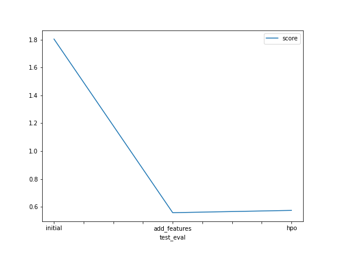

# Report: Predict Bike Sharing Demand with AutoGluon Solution
#### Ramy Gendy

## Initial Training
### What did you realize when you tried to submit your predictions? What changes were needed to the output of the predictor to submit your results?

* Round negative count values to zero
* Round the numbers in count column to zero

### What was the top ranked model that performed?

* WeightedEnsemble_L3

## Exploratory data analysis and feature creation
### What did the exploratory analysis find and how did you add additional features?

* Time series analysis showed that there are data missing for last 10 days of the month and the changes in the demand of every hour during weekday and weekend.
* there was high correlation between month and seasonality. therefore it was removed from features.
* Categorzed continues features like temperature, humidity, wind etc.

### How much better did your model preform after adding additional features and why do you think that is?

* After adding the additional feature, around 30% improvement found in the model score. because adding relevant features (according to domain knowledge) gives in more accurte predictions.

## Hyper parameter tuning
### How much better did your model preform after trying different hyper parameters?

* A slight increase in score after changing the hyper parameters.

### If you were given more time with this dataset, where do you think you would spend more time?

* Will do more work on future engineering and hyperparameter tuning as both are very important processess for building an efficient model.

### Create a table with the models you ran, the hyperparameters modified, and the kaggle score.

|model|hpo1|hpo2|hpo3|score|
|--|--|--|--|--|
|initial|default|default|default|1.80497|
|add_features|default|default|default|0.55774|
|hpo|CAT(iterations)|GB(num_boost_round, num_leaves)|scheduler, searcher|0.57423|

### Create a line plot showing the top model score for the three (or more) training runs during the project.

### Create a line plot showing the top kaggle score for the three (or more) prediction submissions during the project.

## Summary

* In this project, I have explored following:
    1. Better use of the data generated and geain information are keys for successful model.
    2. Analyze Data as described, visualized and modified and built Model using Autogluon AutomML library.
    3. Appling preprocessing with creation of new features and tuning hyper parameters resulting better ML model score.
    4. Compared the models based on the scroe obtained on Kaggle.

